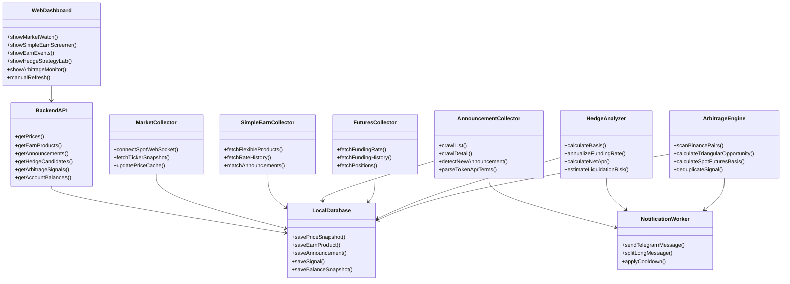

# 주요 컴포넌트 구조

```mermaid
classDiagram
    class WebDashboard {
        +showMarketWatch()
        +showSimpleEarnScreener()
        +showEarnEvents()
        +showHedgeStrategyLab()
        +showArbitrageMonitor()
        +manualRefresh()
    }

    class BackendAPI {
        +getPrices()
        +getEarnProducts()
        +getAnnouncements()
        +getHedgeCandidates()
        +getArbitrageSignals()
        +getAccountBalances()
    }

    class MarketCollector {
        +connectSpotWebSocket()
        +fetchTickerSnapshot()
        +updatePriceCache()
    }

    class SimpleEarnCollector {
        +fetchFlexibleProducts()
        +fetchRateHistory()
        +matchAnnouncements()
    }

    class AnnouncementCollector {
        +crawlList()
        +crawlDetail()
        +detectNewAnnouncement()
        +parseTokenAprTerms()
    }

    class FuturesCollector {
        +fetchFundingRate()
        +fetchFundingHistory()
        +fetchPositions()
    }

    class HedgeAnalyzer {
        +calculateBasis()
        +annualizeFundingRate()
        +calculateNetApr()
        +estimateLiquidationRisk()
    }

    class ArbitrageEngine {
        +scanBinancePairs()
        +calculateTriangularOpportunity()
        +calculateSpotFuturesBasis()
        +deduplicateSignal()
    }

    class NotificationWorker {
        +sendTelegramMessage()
        +splitLongMessage()
        +applyCooldown()
    }

    class LocalDatabase {
        +savePriceSnapshot()
        +saveEarnProduct()
        +saveAnnouncement()
        +saveSignal()
        +saveBalanceSnapshot()
    }

    WebDashboard --> BackendAPI
    BackendAPI --> LocalDatabase
    MarketCollector --> LocalDatabase
    SimpleEarnCollector --> LocalDatabase
    AnnouncementCollector --> LocalDatabase
    FuturesCollector --> LocalDatabase
    HedgeAnalyzer --> LocalDatabase
    ArbitrageEngine --> LocalDatabase
    AnnouncementCollector --> NotificationWorker
    HedgeAnalyzer --> NotificationWorker
    ArbitrageEngine --> NotificationWorker
```
