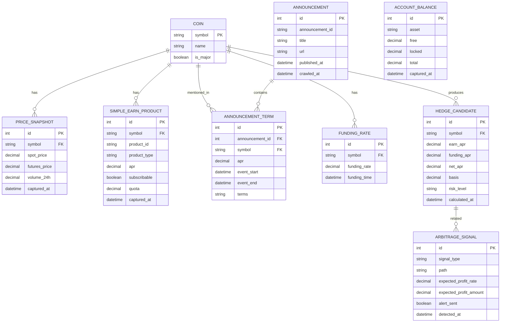

# 데이터 저장 관계 ERD

```mermaid
erDiagram
    COIN {
        string symbol PK
        string name
        boolean is_major
    }

    PRICE_SNAPSHOT {
        int id PK
        string symbol FK
        decimal spot_price
        decimal futures_price
        decimal volume_24h
        datetime captured_at
    }

    SIMPLE_EARN_PRODUCT {
        int id PK
        string symbol FK
        string product_id
        string product_type
        decimal apr
        boolean subscribable
        decimal quota
        datetime captured_at
    }

    ANNOUNCEMENT {
        int id PK
        string announcement_id
        string title
        string url
        datetime published_at
        datetime crawled_at
    }

    ANNOUNCEMENT_TERM {
        int id PK
        int announcement_id FK
        string symbol FK
        decimal apr
        datetime event_start
        datetime event_end
        string terms
    }

    FUNDING_RATE {
        int id PK
        string symbol FK
        decimal funding_rate
        datetime funding_time
    }

    ACCOUNT_BALANCE {
        int id PK
        string asset
        decimal free
        decimal locked
        decimal total
        datetime captured_at
    }

    HEDGE_CANDIDATE {
        int id PK
        string symbol FK
        decimal earn_apr
        decimal funding_apr
        decimal net_apr
        decimal basis
        string risk_level
        datetime calculated_at
    }

    ARBITRAGE_SIGNAL {
        int id PK
        string signal_type
        string path
        decimal expected_profit_rate
        decimal expected_profit_amount
        boolean alert_sent
        datetime detected_at
    }

    COIN ||--o{ PRICE_SNAPSHOT : has
    COIN ||--o{ SIMPLE_EARN_PRODUCT : has
    COIN ||--o{ ANNOUNCEMENT_TERM : mentioned_in
    ANNOUNCEMENT ||--o{ ANNOUNCEMENT_TERM : contains
    COIN ||--o{ FUNDING_RATE : has
    COIN ||--o{ HEDGE_CANDIDATE : produces
    HEDGE_CANDIDATE ||--o{ ARBITRAGE_SIGNAL : related
```
