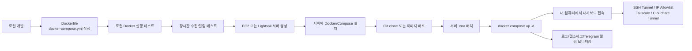

# EC2/Lightsail Docker 배포 운영 흐름

```mermaid
flowchart LR
    Dev["로컬 개발"] --> Dockerize["Dockerfile<br/>docker-compose.yml 작성"]
    Dockerize --> LocalRun["로컬 Docker 실행 테스트"]
    LocalRun --> LongRun["장시간 수집/알림 테스트"]
    LongRun --> Server["EC2 또는 Lightsail 서버 생성"]
    Server --> InstallDocker["서버에 Docker/Compose 설치"]
    InstallDocker --> Deploy["Git clone 또는 이미지 배포"]
    Deploy --> Env["서버 .env 배치"]
    Env --> ComposeUp["docker compose up -d"]
    ComposeUp --> Access["내 컴퓨터에서 대시보드 접속"]
    Access --> Secure["SSH Tunnel / IP Allowlist<br/>Tailscale / Cloudflare Tunnel"]
    ComposeUp --> Monitor["로그/헬스체크/Telegram 알림 모니터링"]
```
