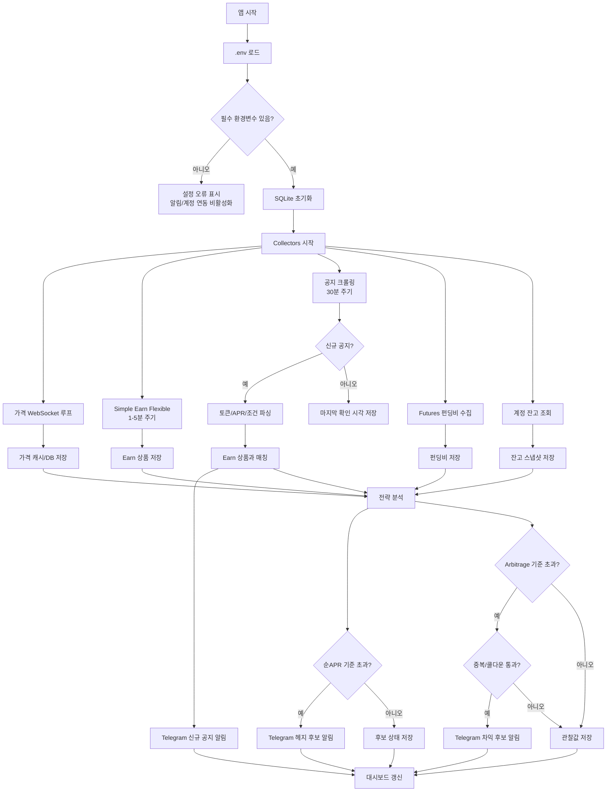

# 데이터 수집 및 알림 판단 작동 로직

```mermaid
flowchart TD
    Start["앱 시작"] --> LoadEnv[".env 로드"]
    LoadEnv --> ValidateSecrets{"필수 환경변수 있음?"}
    ValidateSecrets -- "아니오" --> ConfigError["설정 오류 표시<br/>알림/계정 연동 비활성화"]
    ValidateSecrets -- "예" --> InitDB["SQLite 초기화"]

    InitDB --> StartCollectors["Collectors 시작"]
    StartCollectors --> PriceLoop["가격 WebSocket 루프"]
    StartCollectors --> EarnLoop["Simple Earn Flexible<br/>1-5분 주기"]
    StartCollectors --> AnnLoop["공지 크롤링<br/>30분 주기"]
    StartCollectors --> FundingLoop["Futures 펀딩비 수집"]
    StartCollectors --> BalanceLoop["계정 잔고 조회"]

    PriceLoop --> CachePrice["가격 캐시/DB 저장"]
    EarnLoop --> SaveEarn["Earn 상품 저장"]
    AnnLoop --> NewAnn{"신규 공지?"}
    FundingLoop --> SaveFunding["펀딩비 저장"]
    BalanceLoop --> SaveBalance["잔고 스냅샷 저장"]

    NewAnn -- "예" --> ParseAnn["토큰/APR/조건 파싱"]
    ParseAnn --> MatchEarn["Earn 상품과 매칭"]
    MatchEarn --> NotifyAnn["Telegram 신규 공지 알림"]
    NewAnn -- "아니오" --> SaveCheck["마지막 확인 시각 저장"]

    CachePrice --> Analyze["전략 분석"]
    SaveEarn --> Analyze
    SaveFunding --> Analyze
    SaveBalance --> Analyze
    MatchEarn --> Analyze

    Analyze --> HedgeCheck{"순APR 기준 초과?"}
    Analyze --> ArbCheck{"Arbitrage 기준 초과?"}

    HedgeCheck -- "예" --> NotifyHedge["Telegram 헤지 후보 알림"]
    HedgeCheck -- "아니오" --> SaveHedge["후보 상태 저장"]

    ArbCheck -- "예" --> Cooldown{"중복/쿨다운 통과?"}
    Cooldown -- "예" --> NotifyArb["Telegram 차익 후보 알림"]
    Cooldown -- "아니오" --> SaveArb["관찰값 저장"]
    ArbCheck -- "아니오" --> SaveArb

    NotifyAnn --> Dashboard["대시보드 갱신"]
    NotifyHedge --> Dashboard
    NotifyArb --> Dashboard
    SaveHedge --> Dashboard
    SaveArb --> Dashboard
```
