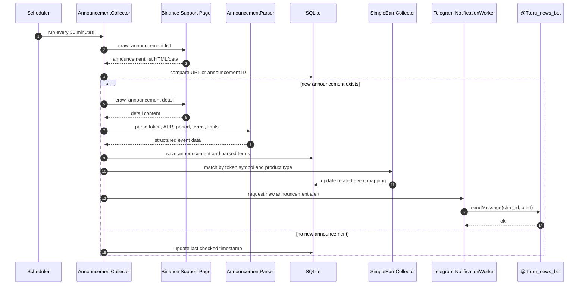
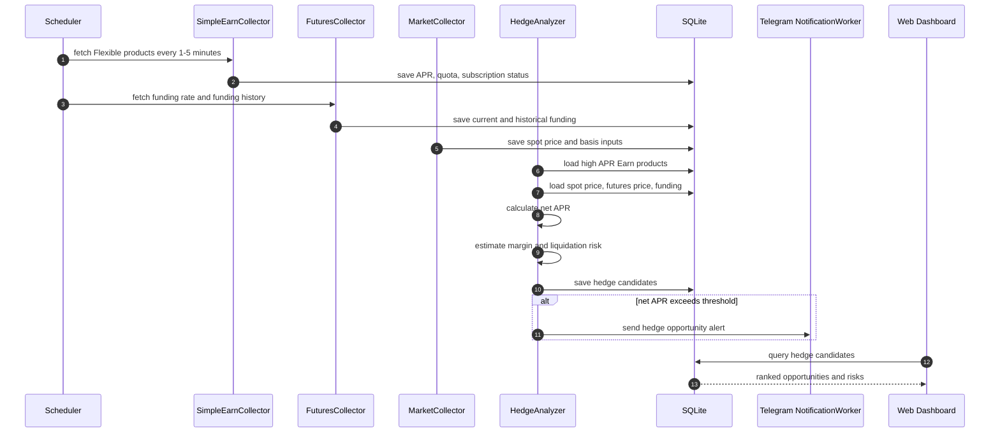
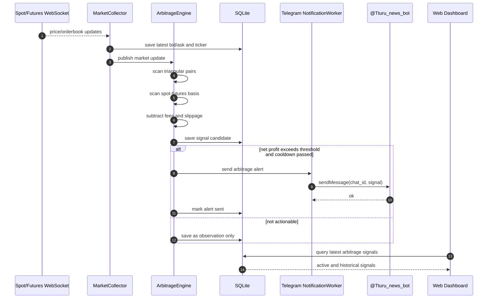

# 주요 시퀀스 다이어그램

## 1. Simple Earn 공지 감지 및 Telegram 알림

공지 데이터는 WebSocket이 아니라 30분 주기 크롤링으로 수집한다. 신규 공지가 발견되면 상세 페이지를 파싱하고 Telegram 알림을 보낸다.

## 2. Simple Earn + Futures 숏 전략 분석

Flexible Earn 상품을 빠르게 갱신하고, Futures 펀딩비와 베이시스를 결합해 예상 순APR을 계산한다.

## 3. Binance 내부 Arbitrage 감지

MVP에서는 Binance 내부 페어만 모니터링한다. 타 거래소는 후속 확장을 위해 exchange adapter 구조로 열어둔다.

