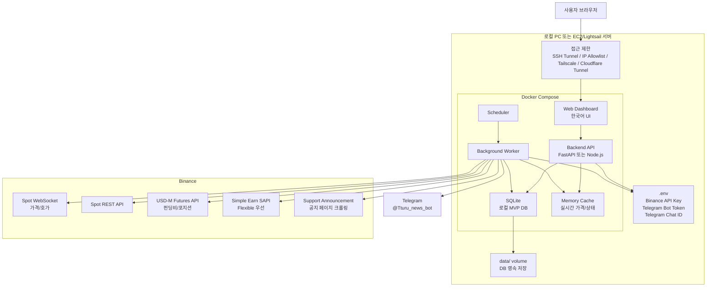

# 전체 서버 구조

초기 MVP는 로컬 실행을 기준으로 하되, 이후 AWS EC2 또는 Lightsail에 Docker Compose로 배포할 수 있게 설계한다.

```mermaid
flowchart TB
    User["사용자 브라우저"]
    Telegram["Telegram<br/>@Tturu_news_bot"]

    subgraph Runtime["로컬 PC 또는 EC2/Lightsail 서버"]
        ReverseAccess["접근 제한<br/>SSH Tunnel / IP Allowlist / Tailscale / Cloudflare Tunnel"]

        subgraph Docker["Docker Compose"]
            Web["Web Dashboard<br/>한국어 UI"]
            API["Backend API<br/>FastAPI 또는 Node.js"]
            Worker["Background Worker"]
            Scheduler["Scheduler"]
            SQLite["SQLite<br/>로컬 MVP DB"]
            Cache["Memory Cache<br/>실시간 가격/상태"]
        end

        Env[".env<br/>Binance API Key<br/>Telegram Bot Token<br/>Telegram Chat ID"]
        DataVolume["data/ volume<br/>DB 영속 저장"]
    end

    subgraph Binance["Binance"]
        SpotWS["Spot WebSocket<br/>가격/호가"]
        SpotAPI["Spot REST API"]
        FuturesAPI["USD-M Futures API<br/>펀딩비/포지션"]
        EarnAPI["Simple Earn SAPI<br/>Flexible 우선"]
        Announcement["Support Announcement<br/>공지 페이지 크롤링"]
    end

    User --> ReverseAccess --> Web
    Web --> API
    API --> SQLite
    API --> Cache
    API --> Env

    Scheduler --> Worker
    Worker --> SpotWS
    Worker --> SpotAPI
    Worker --> FuturesAPI
    Worker --> EarnAPI
    Worker --> Announcement
    Worker --> SQLite
    Worker --> Cache
    Worker --> Env
    Worker --> Telegram

    SQLite --> DataVolume
```
